<div align="center">

<!-- ═══════════════════════════ HERO ═══════════════════════════ -->

[](https://git.io/typing-svg)

<br>



<br><br>


&nbsp;

&nbsp;

&nbsp;

&nbsp;


</div>

---

## 🧑‍💻 About Me

<!-- Replace this with your actual coding GIF -->

<div align="center">


</div>

```javascript
const solyman = {
  name:     "Solyman Wasif",
  role:     "Frontend Developer 🚀",
  location: "Bangladesh 🇧🇩",

  learning: ["React ⚛️", "Node.js 🟢"],
  upcoming: ["Next.js ▲", "Express 🚂", "MongoDB 🍃"],

  approach: "AI as a partner, not a shortcut 🤖",
  goal:     "Job/Internship ready via real projects",

  hobbies: ["Coding 💻", "Gaming 🎮", "Open-World 🌍"],
  motto:   "Think Differently · Solve Creatively · Learn Deep",
};
````

---

## 🛠️ Tech Stack

<details open>
<summary><b>✅ Currently Using</b></summary>

<br>

<div align="center">


</div>

</details>

<details open>
<summary><b>🔧 Tools & Platforms</b></summary>

<br>

<div align="center">


</div>

</details>

<details>
<summary><b>🚀 Coming Soon</b></summary>

<br>

<div align="center">


</div>

</details>

---

## 📈 Learning Roadmap

| Skill               |      Progress     |     Status     |
| :------------------ | :---------------: | :------------: |
| HTML & CSS          | `██████████` 100% |   ✅ Mastered   |
| JavaScript          |  `█████████░` 95% |   ✅ Mastered   |
| TypeScript          |  `████████░░` 85% |   ✅ Completed  |
| React Fundamentals  |  `████████░░` 80% |    🟢 Active   |
| React Hooks         |  `███████░░░` 75% |    🟢 Active   |
| API & Data Fetching |  `██████░░░░` 60% | 🟡 In Progress |
| Node.js             |  `█████░░░░░` 50% | 🟡 In Progress |
| Next.js             |  `░░░░░░░░░░` 0%  |   📅 Upcoming  |
| Express.js          |  `░░░░░░░░░░` 0%  |   📅 Upcoming  |
| MongoDB             |  `░░░░░░░░░░` 0%  |   📅 Upcoming  |

---

## 🚀 Featured Projects

### 🎨 DevConf 2026 · AI CSS Enhancement Challenge

<div align="center">


</div>

<br>

<table>
<tr>

<td width="30%" valign="top">

### 💡 About the Project


<br>

### 🛠️ Tech Stack


<br><br>

[](https://github.com/Solymanwasif/b14-a1-ai-css-enhancement)

</td>

<td width="70%" align="center" valign="middle">

### 👀 Visual Preview


<br>

<sub>✨ Interactive project preview</sub>

</td>

</tr>
</table>

---

### 🌿 Nature's Platter · Fresh Food E-Commerce

<div align="center">


</div>

<br>

<table>
<tr>

<td width="30%" valign="top">

### 💡 About the Project


<br>

### 🛠️ Tech Stack


<br><br>

[](https://github.com/Solymanwasif/Nature-s-platter-shop)

</td>

<td width="70%" align="center" valign="middle">

### 👀 Visual Preview


<br>

<sub>✨ Interactive project preview</sub>

</td>

</tr>
</table>

---

## 🏆 Achievements

|  🏅 | Achievement           | Detail                                        |
| :-: | :-------------------- | :-------------------------------------------- |
|  ⭐  | Perfect Score         | 60/60 on all 4 Programming Hero Assignments   |
|  🚀 | Shipped Projects      | Multiple real-world frontend projects         |
|  🎨 | Responsive Design     | Tailwind CSS mastery                          |
|  📈 | Consistent Growth     | Active GitHub portfolio                       |
|  🤖 | AI-Augmented Learning | AI used as a thinking partner, not a shortcut |

---

## 📊 GitHub Stats

<div align="center">


<br><br>


</div>

---

## 🏅 GitHub Trophies

<div align="center">

[](https://github.com/ryo-ma/github-profile-trophy)

</div>

---

## 📡 Contribution Activity

<div align="center">

[](https://github.com/ashutosh00710/github-readme-activity-graph)

</div>

---

## 🤖 Learning Philosophy

<div align="center">

[](https://git.io/typing-svg)

</div>

---

## 🎮 Gaming

```text
🏆 Main Game  →  Free Fire
🎯 Genres     →  Open-World  •  Story-Driven  •  Strategy
💡 Gaming sharpens: problem-solving, focus & creative thinking
```

---

## 📫 Let's Connect

<div align="center">

[](mailto:reonsolymanwasif@gmail.com)

[](https://github.com/Solymanwasif)

<br>

[](https://git.io/typing-svg)

</div>

---

<div align="center">
<!-- Footer Wave -->

<div align="center">



</div>

<br>

