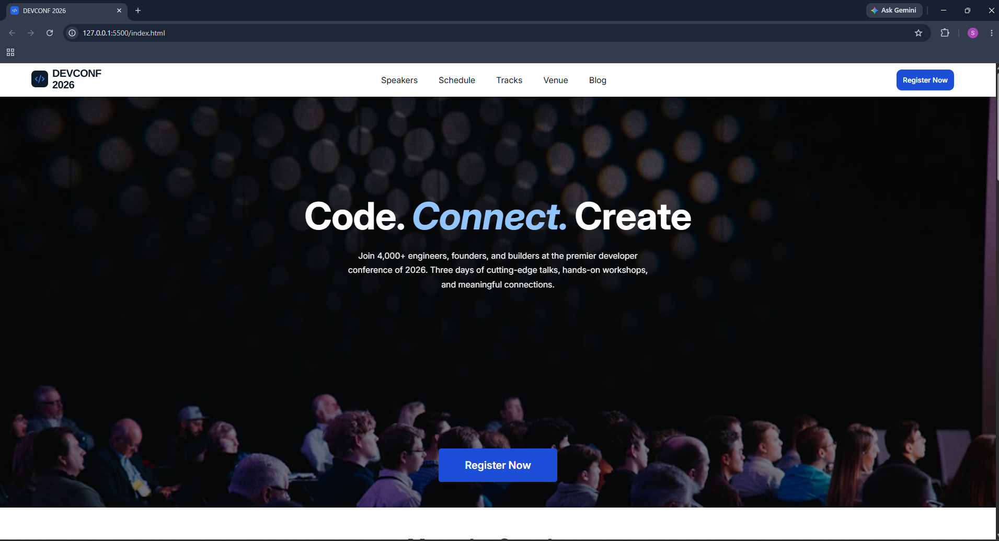
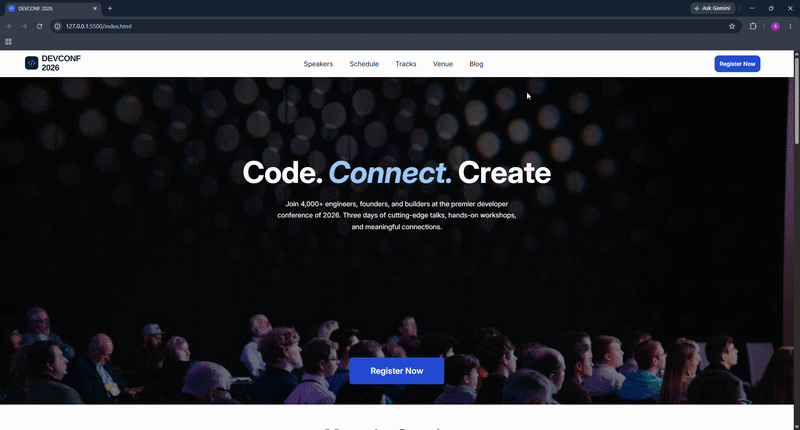
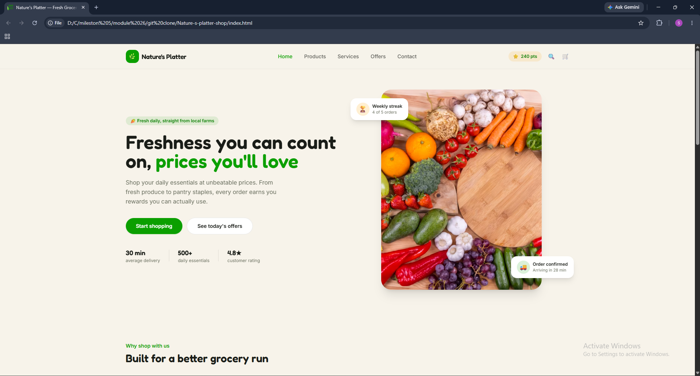
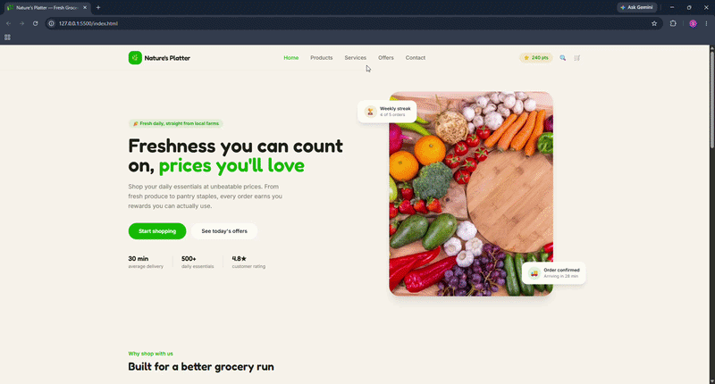

<div align="center">


</div>


# 🎯 CURRENT FOCUS

## 


## 


## 


## 🎮 **ABOUT ME** [LEVEL: BEGINNER] 🎮


> **🧠 Mindset:** Critical thinking + Creative problem-solving + AI-assisted learning
>
> **🎯 Main Focus:** Frontend Development (React ecosystem)
>
> **🚀 Current Mission:** Become job/internship ready by building real-world projects
>
> **🤖 Learning Approach:** Using AI as an assistant, not a replacement
>
> **🎮 Fun Fact:** Passionate gamer | Love open-world & story-driven games | Free Fire 🎮

---

## 📚 **CURRENT LEARNING QUEST** 📚

<div align="center">

| Topic | Status | Progress |
|-------|--------|----------|
| **React Fundamentals** | 🟢 Active | ████████░░ 80% |
| **Components & JSX** | 🟢 Active | █████████░ 90% |
| **State Management (useState)** | 🟢 Active | ████████░░ 80% |
| **Effects & Side Effects (useEffect)** | 🟡 Learning | ███████░░░ 70% |
| **API & Data Fetching** | 🟡 Learning | ██████░░░░ 60% |
| **Node.js Basics** | 🟡 Learning | █████░░░░░ 50% |

</div>

```
Currently Mastering:
  ✨ React Hooks (useState, useEffect, useContext)
  ✨ Conditional & List Rendering
  ✨ Event Handling
  ✨ Props & Component Communication
  ✨ Node.js Server-side Development
```

---

## 🛠️ **TECH STACK** [Unlocked Achievements] 🛠️

### ✅ Currently Learned & Using
<div align="center">


</div>

### 🎯 **LEARNING ROADMAP** [Next Level Skills] 🎯

<div align="center">


**Upcoming:** Mongoose • Authentication • AI-Assisted Coding • Full-Stack Development

</div>

---

## 🏆 **ACHIEVEMENTS UNLOCKED** 🏆

<div align="center">

```
╔════════════════════════════════════════════╗
║           🎖️  ACHIEVEMENT BOARD  🎖️        ║
╚════════════════════════════════════════════╝

  ⭐ Completed 4 Programming Hero Assignments
  ⭐ Perfect Score: 60/60 on all 4 Assignments  
  ⭐ Built Multiple Frontend Projects
  ⭐ Mastered Responsive Design with Tailwind
  ⭐ Active Learner & Problem Solver
  ⭐ Growing GitHub Portfolio
```

</div>

---

---

## 🚀 DEVCONF 2026

<table>
<tr>
<td colspan="2" align="center">

### 🎨 DEVCONF 2026 — AI CSS Enhancement Challenge



</td>
</tr>

<tr>
<td width="60%" valign="middle">

### 💡 ABOUT THE PROJECT


### 🛠️ TECH STACK


### 🎯 FOCUS AREAS


<a href="https://github.com/Solymanwasif/b14-a1-ai-css-enhancement">
  🔗 View Repository
</a>

</td>


</td>

<td width="40%" align="center" valign="middle">

### 👀 Visual Preview



<br>

<sub>✨ Interactive project preview</sub>

</td>
</tr>
</table>

---

## 🛒 NATURE'S PLATTER SHOP

<table>
<tr>
<td colspan="2" align="center">

### 🌿 Nature's Platter — Fresh Food E-Commerce



</td>
</tr>

<tr>

<td width="60%" valign="middle">

### 💡 ABOUT THE PROJECT


### 🛠️ TECH STACK


### 🎯 FOCUS AREAS


<br>

<p align="left">
  <a href="https://github.com/Solymanwasif/Nature-s-platter-shop">
    🔗 View Repository
  </a>
</p>

</td>

<td width="40%" align="center" valign="middle">

### 👀 VISUAL PREVIEW



<br>

<sub>✨ Interactive project preview</sub>

</td>

</tr>
</table>

---
## 🎮 **GAMING PROFILE** 🎮

<div align="center">

```
╔══════════════════════════════════════════╗
║     🎮  FAVORITE GAMES & GENRES  🎮      ║
╚══════════════════════════════════════════╝

  🏆 Main Game: Free Fire
  🎯 Favorite Genres: 
      → Open-World Games
      → Story-Driven Narratives
      → Strategy & Tactical Games
      
  💡 Gaming teaches problem-solving & 
     creative thinking - skills that help coding!
```

</div>

---

## 🤖 **AI & MY LEARNING PHILOSOPHY** 🤖

<div align="center">

```
AI as a LEARNING PARTNER, not a shortcut:

✨ Discuss Problems
✨ Explore Multiple Approaches
✨ Discover Creative Solutions
✨ Understand Core Concepts
✨ Hands-on Implementation

"AI amplifies learning, but understanding is key"
```

</div>

---

## 📊 **GITHUB STATS** 📊

<div align="center">


</div>

---

## 💬 **DEVELOPER MOTTO** 💬

<div align="center">

```
╔════════════════════════════════════════════════════════════╗
║                                                            ║
║     "Think Differently • Solve Creatively • Learn Deep"   ║
║                                                            ║
║        Code • Learn • Think • Build 🚀                    ║
║                                                            ║
╚════════════════════════════════════════════════════════════╝
```

</div>

---

## 📫 **LET'S CONNECT** 📫

<div align="center">

[](mailto:reonsolymanwasif@gmail.com)
[](https://github.com/Solymanwasif)
[](https://linkedin.com)

</div>

---

<div align="center">

### 🌟 **Thank you for visiting my profile!** 🌟
### _Let's build something amazing together_ 🚀

```
> Always remember: 
  "Every expert was once a beginner"
  Keep coding, keep learning, keep growing! 💪
```

</div>

---

<div align="center">


</div>
