  
About Me

I'm a beginner developer focused on frontend development — currently learning React and Node.js, building small projects, and preparing myself for real-world development work.

I enjoy full-stack concepts, but frontend is where I spend most of my energy and interest.

🔭 Learning React & Node.js
🎯 Working toward being job / internship ready
🧩 Prefer understanding why something works over memorizing how
🤖 Use AI as a thinking partner, not a shortcut

Think critically. Solve creatively. Keep learning.

 
Currently Learning
<table> <tr> <td valign="top" width="50%">

React Fundamentals · Components · JSX (+ TypeScript) · Props · Conditional & list rendering · Vite · Event handling · State · Re-rendering · useState · Fetch & async/await · React Suspense · Data fetching · useEffect · Thinking in React

</td> <td valign="top" width="50%">

Node.js Just getting started — early stage of learning the fundamentals.

</td> </tr> </table>

Still learning both — not claiming mastery, just showing consistent progress.

 
Tech Stack

Core focus — frontend

Currently learning

Tools

  
Learning Roadmap
Stage	Technology
Learned	HTML, CSS, JavaScript, TypeScript
Currently learning	React, Node.js
Upcoming	SVG, Tailwind CSS, Next.js, Express.js, MongoDB, Mongoose, Better Auth

This roadmap reflects where I actually am — not where I plan to be.

 
Featured Project

DEVCONF 2026

A conference-themed frontend website, built to practice structuring a real multi-section page.

Sections: Navigation · Hero · Speakers · Schedule · Pricing · Footer Built with: HTML · CSS · Basic JavaScript

View Repository →

 
Other Project

Nature's Platter

A grocery / e-commerce style frontend project, focused on responsive layout.

Focus: Responsive design · Tailwind CSS

 
GitHub Stats

I'm not a high-activity GitHub user yet — that's something I'm actively working on improving.

 
Goals
Become job / internship ready
Gain real, hands-on development experience
Keep learning consistently
Keep thinking critically and solving problems creatively
 
Achievements

Completed 4 Programming Hero course assignments, scoring 60/60 on all four.

A learning milestone, not a certification — but a good marker of consistency.

 
AI & My Learning Approach

I use AI as part of how I learn — not as a replacement for learning.

I try to build things myself and understand the underlying concept first. AI helps me discuss a problem before jumping to a solution, explore different approaches, understand concepts I'm stuck on, and find creative, alternative solutions.

I'm not an AI engineer, and that's not my current direction — AI is simply a tool in my workflow right now.

 
Gaming (fun fact)

Outside of code, I'm a gamer.

Favorite game: Free Fire Genres I gravitate toward: Open-world · Story-driven · Strategy

 
Contact

 

  
<em>Thanks for reading this far — always open to connecting on interesting projects.</em>

