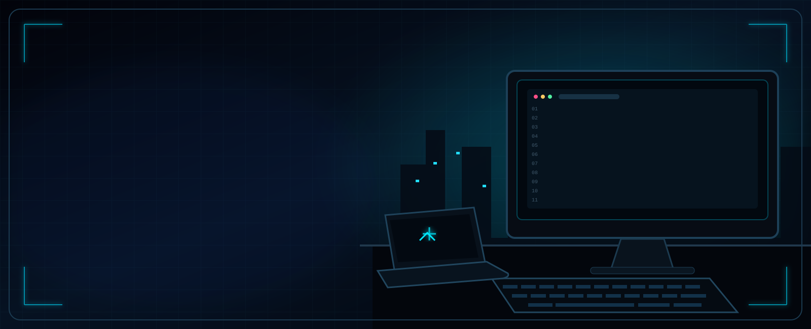

<!-- ═══════════════════════════ HERO ═══════════════════════════ -->

 

  

&nbsp;

&nbsp;

&nbsp;

&nbsp;

---

javascript
const solyman = {

  name: "Solyman Wasif",

  role: "Frontend Developer 🚀",

  location: "Bangladesh 🇧🇩",

  currentlyLearning: [
    "React ⚛️",
    "Node.js 🟢",
    "Next.js ▲"
  ],

  building: [
    "Responsive Web Applications",
    "Modern User Interfaces",
    "Real-world Frontend Projects"
  ],

  exploring: [
    "Express.js 🚂",
    "MongoDB 🍃",
    "Full Stack Development"
  ],

  approach:
    "AI as a partner, not a shortcut 🤖",

  goal:
    "Become a Full Stack Developer through real-world projects",

  hobbies: [
    "Coding 💻",
    "Gaming 🎮",
    "Exploring Technology 🌍"
  ],

  motto:
    "Think Differently · Solve Creatively · Learn Deep"

};
