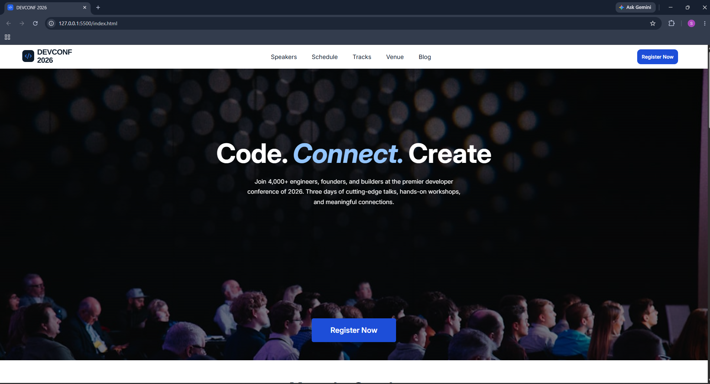
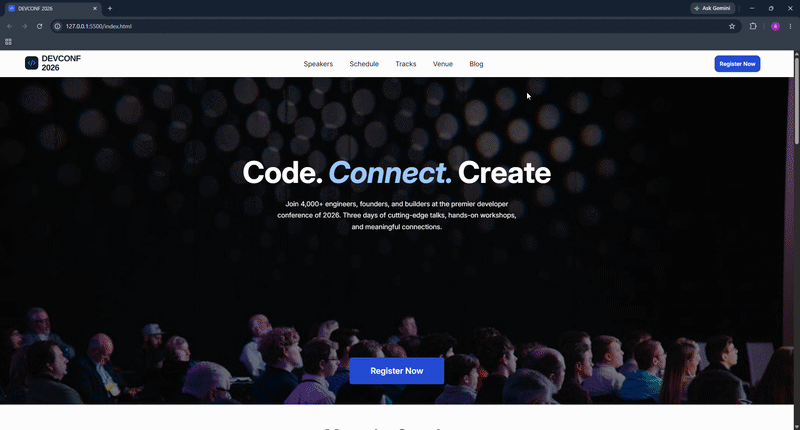
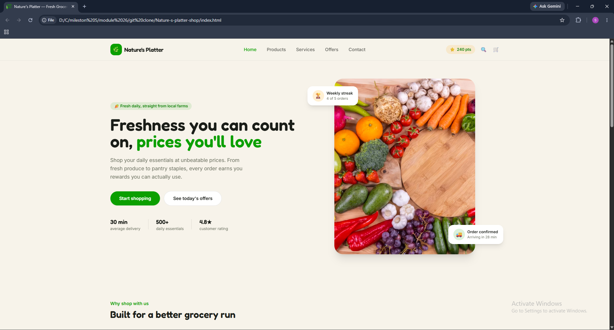
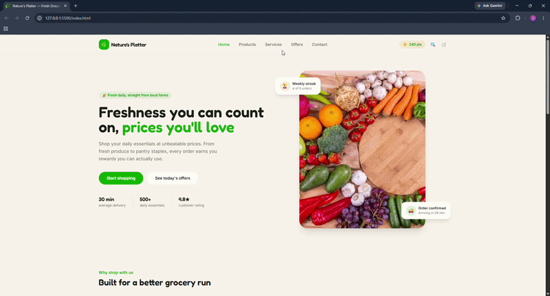

<div align="center">


<!-- ═══════════════════════════ HERO SECTION ═══════════════════════════ -->


[](https://git.io/typing-svg)


<br>


<br><br>


<!-- ═══════════════════════════ PROFILE BADGES ═══════════════════════════ -->


<div align="center">


&nbsp;

&nbsp;

&nbsp;

&nbsp;


</div>
</div>
---

## 👨‍💻 Developer Profile


```javascript
const solyman = {

    name: "Solyman Wasif",

    role: "Frontend Developer 🚀",

    location: "Bangladesh 🇧🇩",


    currentlyLearning: [
        "React ⚛️",
        "TypeScript 📘",
        "Node.js 🟢"
    ],


    exploring: [
        "Next.js ▲",
        "Express.js 🚂",
        "MongoDB 🍃"
    ],


    building: [
        "Responsive Web Applications",
        "Modern User Interfaces",
        "Real-world Projects"
    ],


    approach:
        "AI as a partner, not a shortcut 🤖",


    goal:
        "Become a Full Stack Developer through practical projects",


    hobbies: [
        "Coding 💻",
        "Gaming 🎮",
        "Technology Exploration 🌍"
    ],


    motto:
        "Think Differently · Solve Creatively · Learn Deep"

};
```

<table>

<tr>


<td width="60%" valign="top">


# 🛠️ Tech Stack


<div align="center">


</div>


<br>


## ⚡ Technologies I Work With


<table>

<tr>

<td align="center" width="33%">

🌐  
<b>Frontend</b>

<br><br>

HTML5  
CSS3  
JavaScript  
TypeScript  
React.js  
Tailwind CSS

</td>


<td align="center" width="33%">
⚙️  
<b>Backend</b>

<br><br>

Node.js  
Express.js  
REST API  
Firebase

</td>


<td align="center" width="33%">

🗄️  
<b>Database & Tools</b>

<br><br>

MongoDB  
Git  
GitHub  
VS Code  
Figma

</td>


</tr>

</table>


</td>


<td width="40%" align="center" valign="middle">


<br><br>


## 🚀 Skills


<br><br>


[](https://git.io/typing-svg)


</td>


</tr>


</table>

# 🚀 Featured Projects


## 🎨 DevConf 2026 · AI CSS Enhancement Challenge


<div align="center">





</div>


<br>


<table>

<tr>


<td width="30%" valign="top">


## 💡 About the Project


A modern conference-themed frontend website built to practice responsive design, creative CSS styling, and interactive user interface development.


<br>


## 🛠️ Tech Stack


<div align="center">


</div>


<br>


## ✨ Features


✅ Modern conference landing page design  

✅ Fully responsive layout  

✅ Clean and structured HTML  

✅ Custom CSS animations  

✅ Interactive frontend components  

✅ Mobile-friendly interface  


<br>


## 📦 Dependencies


This project does not use any external dependencies.


No package installation required


</td>


<td width="70%" align="center" valign="middle">


## 👀 Visual Preview





<br>


<sub>✨ Interactive project preview</sub>


[](https://b14-a1-ai-css-enhancement.vercel.app/)

[](https://github.com/Solymanwasif/b14-a1-ai-css-enhancement)
</td>


</tr>


</table>


---
## 🌿 Nature's Platter · Fresh Food E-Commerce


<div align="center">





</div>


<br>


<table>

<tr>


<td width="30%" valign="top">


## 💡 About the Project


A modern fresh food e-commerce website built to practice responsive web design, clean UI development, and interactive frontend experiences using HTML, CSS, and JavaScript.


<br>


## 🛠️ Tech Stack


<div align="center">


</div>


<br>


## ✨ Features


✅ Fresh food product showcase  

✅ Responsive design for all devices  

✅ Clean and modern user interface  

✅ Interactive navigation elements  

✅ Product-focused layout  

✅ Mobile-friendly experience  


<br>


## 📦 Dependencies


This project does not use any external dependencies.


No package installation required


</td>


<td width="70%" align="center" valign="middle">


## 👀 Visual Preview





<br>


<sub>✨ Interactive project preview</sub>


<br><br>


[](https://natures-platter-shop.vercel.app/)
[](https://github.com/Solymanwasif/Nature-s-platter-shop)


</td>


</tr>


</table>


---

# 🏆 Achievements


<div align="center">


| 🏅 | Achievement | Details |
| :-: | :--- | :--- |
| ⭐ | Frontend Development | Built responsive and interactive web applications |
| 🚀 | Real-world Projects | Developed projects using modern frontend technologies |
| 🎨 | UI Development | Created clean and user-friendly interfaces |
| 💻 | Problem Solving | Continuously improving programming skills |
| 🤖 | AI-Assisted Learning | Using AI tools to improve development workflow |


</div>


---


# 📊 GitHub Statistics


<div align="center">





<br><br>


<br><br>





</div>


---

# 🏅 GitHub Trophies


<div align="center">





</div>


---


# 📡 Contribution Activity


<div align="center">





</div>


---


# 🐍 Contribution Snake


<div align="center">


</div>


---

# 🤖 Learning Philosophy


<div align="center">


[](https://git.io/typing-svg)


</div>


<br>


<div align="center">


> "Learning by building, improving through practice, and creating solutions that make an impact."


</div>


---


# 📫 Let's Connect


<div align="center">


[](mailto:reonsolymanwasif@gmail.com)


[](https://github.com/Solymanwasif)


<br><br>


[](https://git.io/typing-svg)


</div>


---

<!-- ═══════════════════════════ CONTRIBUTION SNAKE ═══════════════════════════ -->


<div align="center">


</div>


---


<!-- ═══════════════════════════ FOOTER WAVE ═══════════════════════════ -->


<div align="center">





</div>


<br>


<div align="center">


### ⭐ Thanks for visiting my profile!<br>
### 🚀 Keep Learning · Keep Building · Keep Growing


<br>


</div>
